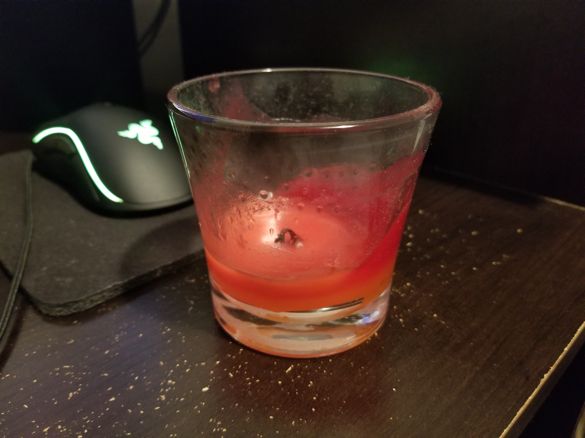

# CMPM163Labs

## Lab 2

https://drive.google.com/file/d/1DHHXDYq4aucAgJnbjUAhaxmkKC8zRO7j/view?usp=sharing

## Lab 3

https://drive.google.com/file/d/1Q60xYiMiFD4jxCfeGd2AZpRJM240OXfW/view?usp=sharing

## Lab 4

https://drive.google.com/open?id=1lE-ZvlHttUzJwE-_QKegnCJCoAHnNI2J

CUBE 1: I simply used three.js's loadTecture method to load in the jpg and I added it to my material.

CUBE 2: I used the same method that I used for the previous cube, but also added a second texture that I added onto my material as a normal map, that paired with the texture.

CUBE 3: I used the same methods from the previous cube, but for this one I found a colorful texture and matched it with a very bumpy normal map that made it look very interesting.

CUBE 4: I loaded in both the fragment and vertex shader and passed my texture to my shader which I then used to create the material for my object.

CUBE 5: I again used my fragment and vertex shaders to handle my texture sample. I finished the first portion of this part by multiplying the uv by 2.0, when defining my 2D texture in my fragment shader. This doubled the size of my uv map, and moved the texture down the the bottom left corner of the face of the cube. But the texture didn't tile or repeat, instead it had a clamp to edge effect, which was probably the default for the texture. I had to look for a while to figure out how to repeat the texture to create a tiling effect. I knew about GL_REPEAT, and the two lines of code:
glTexParameteri(GL_TEXTURE_2D, GL_TEXTURE_WRAP_S, GL_REPEAT);
glTexParameteri(GL_TEXTURE_2D, GL_TEXTURE_WRAP_T, GL_REPEAT);
but I couldn't figure out how to incorporate them into my program. Later, I found out that three.js has a wrapS and wrapT property on a texture and I could change it's mapping mode with THREE.RepeatWrapping. I'm sure there's many ways to do this, and I would like to learn more about it.

24)

a) In order to get the pixel of a texture sample from a u value you use u*8, 8 being the x length of the texture sample.

b) In order to get the pixel of a texture sample from a v value you use v*8, 8 being the y length of the texture sample.

c) The uv coordinate (0.375, 0.25) maps to the (3, 2) which is a gray colored pixel.

## Lab 5

#### 1. The link to a video of me moving around the static particles that change colors
https://drive.google.com/open?id=1VFNOXfXAqMg39t560XlvyMIl6LIVKDlK

#### 2. The link to a video of the explosion of particles
https://drive.google.com/file/d/1eqCSIIOheGmgH8alJD2OXDDV2M0YPESw/view?usp=sharing

#### 3. The link to a video of my custom particle animation
https://drive.google.com/open?id=1-QaMj-mK0dXx-cWE5BqGzae2lGpD_bmZ

In order to create this animation, I used the combination of the sine and cosine math functions in javascript with the performance.now function, to give me a continous increase in numbers, to form a rotational pattern along the x, y and z axis of the particle group. I also used the same method to animate the lights around the dog mesh.

## Lab 6

#### i. Screenshot of objects:

#### ii. Definitions:
Point light: Sends light out in all directions equally within its radius.

Spotlight: Sends light out in a cone-shaped region from its constrained angle.

Directional light: Simulates sunlight like light, infinitely far away, that light up the scene from a specific angle.

Area light: Defined by a rectangular space, the light is emitted in all directions across its surface, from one side of the rectangle.
#### iii.
Real object:

Recreation:

#### iv. Explanation of object's material:
For the object I started by making a basic mesh of the candle in Maya. Then I imported it into unity and I used the standard shader and used the Fade rendering mode on the glass container. I made it pretty metallic, so it would be very reflective, and I set it to around 80% smoothness and it became shiny like glass. I also added a texture and a normal map of a dimpled material. The wax I used the image of a bumpy wall for the metallic texture and turned the smoothness pretty low. I also added a normal map of the texture. Lastly, the wick I simply shrunk a simple cylinder object in unity and added the wood texture from the ground and used the glass normal map and brought down its metallic and smoothness levels.
#### v. Description of two textured objects:
I used a wood texture and normal map for the plane I used as the ground for my scene. I also used a charred wood texture and normal map for the sphere.
#### vi. Description of skybox:
For the skybox I downloaded the AllSkyFree pack from the unity asset store and used their Deep Dusk skybox.
